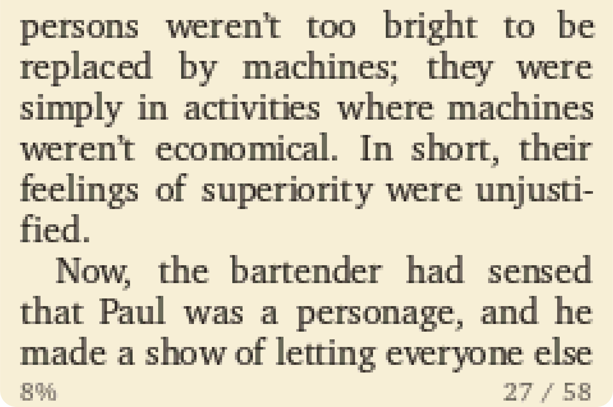

<p align="center">
  
</p>

<p align="center">
  
  
  
</p>

# bookboyadvance

Turn EPUBs into a paperback-style e-reader ROM for the Game Boy Advance.

Text is typeset ahead of time — justified
[XCharter](https://ctan.org/pkg/xcharter) with real kerning and Liang
hyphenation, chapters, per-book bookmarks, and two reading palettes (paperback
and night) — then packed into a `.gba` that runs on a flashcart or emulator. A
hand-drawn library screen lets you browse a stack of books; an animated pair of
hands lifts your pick off the shelf.

Make a ROM two ways:

- **In your browser** at **[bookboy.drawvid.com](https://bookboy.drawvid.com)** —
  drop in EPUBs, download a `.gba`. Nothing is uploaded; the same C typesetting
  core runs locally as WebAssembly.
- **From this repo** with `make`, for a full multi-book library build.

## How it works

One deterministic, fixed-point typesetting engine, replayed identically on
three targets — the host CLI, WebAssembly, and the ARM7 GBA runtime. Layout is
computed once (glyph positions in 12.4 fixed point, snapped once per glyph), so
the device just replays line records — no layout on a 16 MHz CPU.

```
EPUB ──parse──► paragraphs ──typeset──► binary blobs ──pack──► .gba
```

- `tools/` — the host C toolchain: EPUB parsing (`bb_epub.c`), FreeType
  rasterization + kerning (`bb_font.c`), image/cover work (`bb_image.c`),
  hyphenation (`bb_hyphen.c`), and layout/pagination (`bookbuild.c`).
  `bb_wasm.c` compiles the same core to WebAssembly; `rompack.c` packs a
  prebuilt stub with the data blobs into a ROM.
- `src/main.c` — the entire GBA runtime.
- `web/` — the zero-dependency converter site.
- `assets/art/` — the hand-drawn PNGs; their geometry lives in `tools/bb_art.h`.

## Building

Needs a C compiler, `freetype2` + `libjpeg` (via `pkg-config`), and `unzip`;
[devkitARM](https://devkitpro.org) for the GBA stub and
[Emscripten](https://emscripten.org) for the wasm core.

```sh
make            # build out/bookboyadvance.gba
make wasm       # build the WebAssembly core
make test       # smoke-test the wasm core
```

Put your `.epub` files in `./books`; the builder converts every EPUB it can and
packs as many as fit in 32 MB, smallest-first.

## Putting a ROM on a Game Boy

You need a **flashcart** — a cartridge with a microSD slot. Copy the `.gba`
onto the card (FAT32, any folder) and pick it from the cart menu; reading
position saves automatically. In the reader: `A`/`→`/`R` page forward, `←`/`L`
back, `↑`/`↓` jump chapters, `SELECT` toggles the palette, `B` returns to the
library.

The **EZ-Flash Air** (~$40) is the budget flashcart; the **EverDrive GBA Mini**
(~$99) is the premium drag-and-drop option. Any GBA plays it — the backlit SP
(AGS-101) has the best screen. No hardware? [mGBA](https://mgba.io) (desktop),
Delta (iOS), or Lemuroid (Android).

## Deploying the web converter

The site is fully static. Build, then push `web/` to any static host (the
reference deploy is S3 + CloudFront); serve `*.wasm` as `application/wasm`.

```sh
make wasm && make websync
```

## Licensing

- **Code** — MIT (`LICENSE`).
- **Artwork** in `assets/art/` — CC BY 4.0 (`assets/art/LICENSE`).
- **Bundled third-party** components (XCharter fonts, hyphenation patterns,
  stb, adapted Pillow resample code) retain their own licenses — see
  `LICENSES/`.
